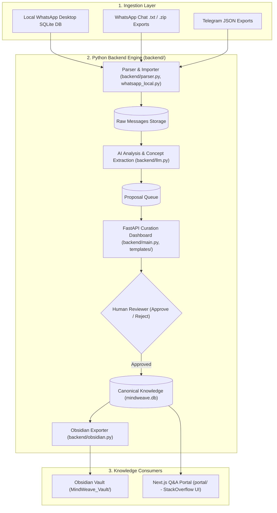

# MindWeave

> **Where conversations become collective knowledge.**

MindWeave is an AI-powered collective learning system that turns group conversations (such as WhatsApp learning groups) into an evolving, connected, reviewable knowledge base.

---

## Core Principle: Human-in-the-Loop

MindWeave adheres to a strict architectural boundary:

```text
raw conversation ───► AI analysis ───► proposed change ───► human approval ───► canonical knowledge
                                                                   │
                                                                   ├──► Obsidian Vault
                                                                   └──► Next.js Q&A Portal
```

**An LLM, background job, or import script is never permitted to write directly to canonical knowledge.** AI models generate structured proposals; only human review and explicit approval can create or update canonical knowledge items, record relationships, and append revision history.

---

## Architecture

MindWeave is decoupled into two primary systems:



### Part 1: The Engine (`backend/`)
- **Technology Stack**: Python 3.9+, FastAPI, Jinja2 templates, SQLite, LLM APIs (Gemini / offline heuristic provider).
- **Directory**: `backend/`
- **Key Responsibilities**:
  - **Data Ingestion**: Directly extract chats from macOS WhatsApp SQLite database (`backend/whatsapp_local.py`) or parse `.txt` / `.zip` chat exports (`backend/parser.py`).
  - **AI Analysis**: Batch messages to detect questions, answers, insights, and extract atomic "knowledge concepts" (`backend/llm.py`).
  - **Curation Dashboard**: A local web interface at `http://localhost:8000` to review, approve, edit, or reject pending AI proposals (`backend/main.py`, `backend/templates/`).
  - **Canonical Storage**: Persist approved knowledge, revisions, contributors, source-message provenance, and semantic relationships (`mindweave.db`).
  - **Obsidian Sync**: Export approved knowledge items directly into a local Obsidian vault (`MindWeave_Vault/` via `backend/obsidian.py`).
  - **CLI Tools**: Headless commands for automated ingestion, analysis, review export, and syncing (`backend/cli.py`).

### Part 2: The Portal (`portal/`)
- **Technology Stack**: Node.js, Next.js (React), Vanilla CSS.
- **Directory**: `portal/`
- **Key Responsibilities**:
  - **Public-Facing Interface**: Modern, responsive StackOverflow-style Q&A web portal for community members.
  - **Read-Only**: Safely reads approved, curated knowledge from SQLite / backend API.
  - **Provenance & Graph Visualization**: Allows users to explore concept explanations, inspect the original conversation messages that produced them, and navigate related concepts.

---

## Directory Structure

```text
MindWeave/
├── README.md                     # Project overview and architecture (this file)
├── backend/                      # Python Backend Engine & Curation Dashboard
│   ├── cli.py                    # Command-line interface for sync, review, & export
│   ├── db.py                     # SQLite database schema and approval transactions
│   ├── llm.py                    # LLM provider interface (Gemini & Heuristic)
│   ├── main.py                   # FastAPI web application routes
│   ├── models.py                 # Data models (ParsedMessage, ProposedChange, etc.)
│   ├── obsidian.py               # Obsidian vault synchronization
│   ├── parser.py                 # WhatsApp and Telegram transcript parsers
│   ├── whatsapp_local.py         # Direct macOS WhatsApp SQLite database reader
│   ├── static/                   # CSS and frontend assets for dashboard
│   └── templates/                # Jinja2 templates for admin curation UI
├── portal/                       # Next.js StackOverflow-style Q&A knowledge web app
│   ├── app/                      # Next.js app router pages and components
│   ├── package.json              # Portal dependencies and scripts
│   └── public/                   # Static assets for the portal
├── docs/                         # Detailed documentation and guidelines
│   ├── HELP.md                   # Quick start commands and troubleshooting
│   ├── ProjectSourceKnowledgeHub.md  # Product specification and milestone roadmap
│   ├── AGENTS.md                 # Agent and contributor engineering rules
│   ├── GEMINI.md                 # Gemini LLM integration instructions
│   ├── HANDOFF_GEMINI.md         # Milestone handoff notes
│   └── Automate WhatsApp Knowledge Workflow.pdf # Visual workflow guide
├── database/                     # SQLite database directory (database/mindweave.db)
├── MindWeave_Vault/              # Auto-generated Obsidian markdown knowledge vault
├── samples/                      # Sample chat export files for testing
├── tests/                        # Automated test suite
└── requirements.txt              # Python dependencies
```

---

## Getting Started

### 1. Prerequisites
- **Python 3.9+**
- **Node.js 18+** (for the portal)

### 2. Set Up the Backend Engine

```bash
# 1. Create and activate virtual environment
python3 -m venv .venv
source .venv/bin/activate

# 2. Install dependencies
pip install -r requirements.txt

# 3. Start the FastAPI curation dashboard
uvicorn backend.main:app --reload
```
Open your browser at **`http://localhost:8000`** to access the Curation Dashboard.

### 3. Sync WhatsApp Messages via CLI

To ingest messages manually from your local WhatsApp Desktop application:

```bash
.venv/bin/python -m backend.cli sync-local "Group Name Here"
```

### 4. Automated Daily Ingestion (Milestone 11)

Run the automated ingestion pipeline (retrieves new chats, extracts AI proposals, and discovers semantic links):

```bash
# Run one-off daily sync
.venv/bin/python -m backend.cli daily-sync --group "Group Name Here" --discover-links

# Install native macOS nightly scheduler (e.g., runs every day at 02:00 AM)
.venv/bin/python -m backend.cli setup-schedule --install --time 02:00
```

### 5. Semantic Relationship Discovery (Milestone 10)

Infer and link semantic relationships across all existing approved knowledge items:

```bash
.venv/bin/python -m backend.cli link-concepts
```

### 6. Export to Obsidian

To export all approved knowledge into your local Obsidian vault (`MindWeave_Vault/`):

```bash
.venv/bin/python -m backend.cli export-obsidian
```

### 7. Run the Q&A Portal (Frontend)

```bash
cd portal
npm install
npm run dev
```
Open **`http://localhost:3001`** to browse the community knowledge base.

### 6. Run Automated Tests

```bash
.venv/bin/python -m unittest discover -s tests -v
```

---

## Documentation Links

For deeper technical specifications, workflows, and developer guides, refer to the [`docs/`](docs/) directory:

- [**Help & Quick Start Guide**](docs/HELP.md): Terminal commands, CLI reference, and troubleshooting.
- [**Project Specification & Roadmap**](docs/ProjectSourceKnowledgeHub.md): Core use cases, design principles, and upcoming milestones.
- [**Agent Guidelines (AGENTS.md)**](docs/AGENTS.md): Architectural boundaries, immutability rules, and system contracts.
- [**Gemini Provider Guide**](docs/GEMINI.md): Implementation details for Gemini structured output analysis.
- [**Handoff Notes**](docs/HANDOFF_GEMINI.md): Context and state for contributors and coding agents.
- [**Workflow Automation Guide (PDF)**](docs/Automate%20WhatsApp%20Knowledge%20Workflow.pdf): End-to-end visual workflow for syncing and processing WhatsApp knowledge.
